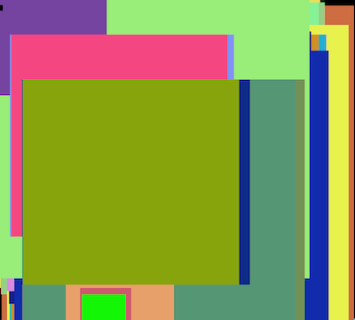

libfb
=====

A simple Linux framebuffer drawing lib

You may want to install (for Ubuntu): libpng12-dev, libfreetype6-dev, ttf-liberation (or any other TTF font) or similar.

Check src/demos/squares.lua and luajit/arvre.lua for calling the lib from LuaJIT.

